# Git

### Desenvolvimento de Software 3

---


---

## Agenda

- Introdução
- Comandos iniciais
- Fases do commit
- Workflows
- Desafios comuns

---

<!--
## Tópicos - Parte 2

* Code review
* Github & Forking Workflow
* CI e CD

--- -->

## Introdução

- Contexto histórico
- Por que Git?
- O que é um repositório

---

## Comandos iniciais

---

- **git init**: cria um diretório .git com subdiretórios para objetos e referências
- **git branch**: operações em _branches_ como listar, criar e remover
- **git checkout**: altera branch a ser trabalhado
- **git add** indexa arquivos a serem commitados
- **git commit _-m_**: consolida modificações

---

### Exemplo: inicialização de um repositório para um novo projeto

---

_Inicializando git e realizando o primeiro commit_

```console
  home$ mkdir projeto && cd projeto
  projeto$ git init
  projeto$ echo "Hello From Git" >> README.md
  projeto$ git add README.md
  projeto$ git commit -m "started readme.me file"
  [master (root-commit) f35a9c8] started readme.me file
  1 file changed, 1 insertion(+)
  create mode 100644 README.md
```

---

```console
projeto$ git log --oneline
f35a9c8 (HEAD -> master) started readme.me file
```

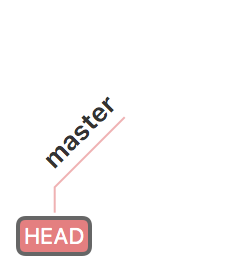

---

_Criando o branch **dev** e adicionado um commit_

```console
  projeto$ git checkout -b dev
  Switched to a new branch 'dev'
  projeto$ echo "This is a demo repo" >> README.md
  projeto$ git add README.md
  projeto$ git commit -m "added repo description"
   [dev 596ff92] added repo description
    1 file changed, 1 insertion(+)
```

---

```console
  projeto$ git log --oneline
  596ff92 (HEAD -> dev) added repo description
  f35a9c8 (master) started readme.me file
```

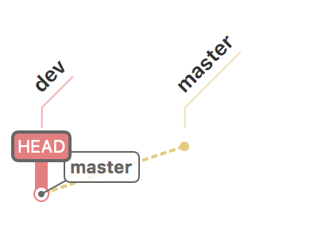

---

_Checando alterações em relação ao branch **master**._

```console
git diff master
```

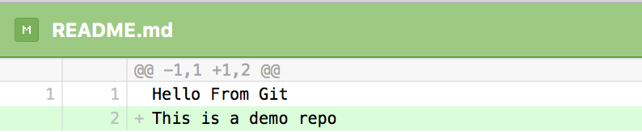

---

## Fases do commit

---

## Unstaged

- Contém, à priori, todas as modificações no diretório do projeto
- alterações que permaneçam nesse estado não serão enviadas à origem

---

## Staging

- através do comando git-add, as modificações realizadas são indexadas.
- novas alterações no arquivo passam a ser seguras
- representa um estado anterior ao commit

---

## Commit

- todas as alterações indexadas são encapsuladas em um commit
- deve conter uma mensagem curta e auto explicativa
- gera-se um hash único para essas alterações

---

## HEAD

- Representa o um ponteiro para a referência do branch atual que, por sua vez, é um ponteiro para o último commit realizado nesse branch.
- O diretório do projeto será um reflexo do útlimo commit associado à HEAD

---


---

# Workflows

---

- Centralizado
- Feature Branching
- Gitflow

---

## Centralizado

---

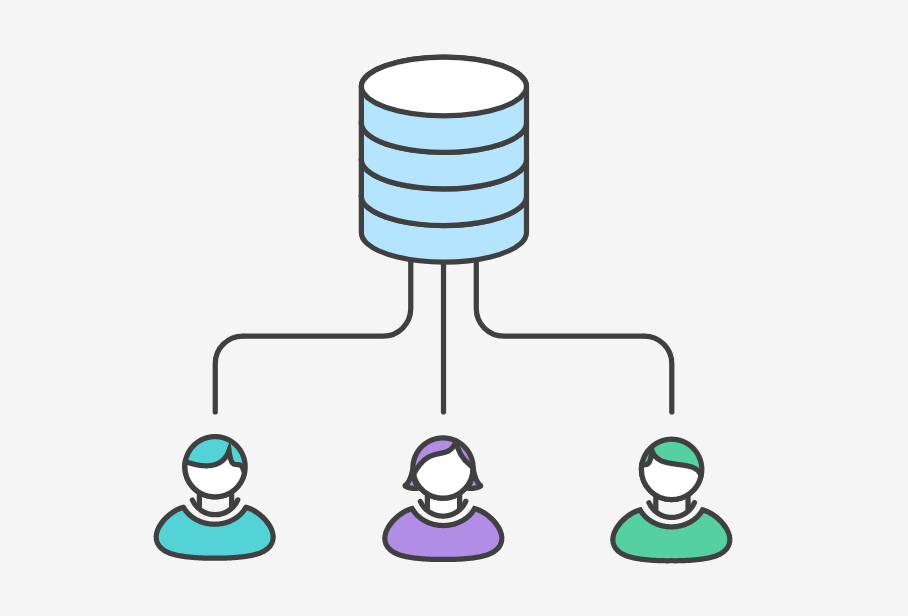

---

- commits são feitos diretamente no branch master
- ideal para quem está em trasição do SVN
- à medida que o projeto e time crescem, essa estratégia pode se tornar um problema

---

## Feature Branch

---

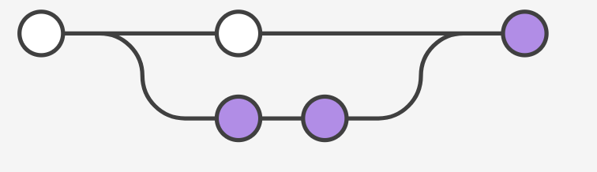

---

- Funcionalidades são desenvolvidas isoladamente
- Minimiza a ocorrência de conflitos
- Ao serem finalizadas, as funcionalidades são unificadas no branch **master**
- Apesar de proporcionar uma melhor organização do desenvolvimento, não há definição de estratégias para lidar com fluxo de correção de bugs, publicação e testes.

---

# Gitflow

---

- Aborda praticamente todas as situações esperadas no ciclo de desenvolvimento e manutenção de um projeto
- Facilita a integração de ferramentas para Continuous Integration & Deployment.
- Conflitos são mínimos
- Facilita a manutenção de mais de uma versão do sistema em produção
- Atende a todos os tamanhos de projetos

---

### Possui branches para

- Hotfixes
- Features
- Releases

---

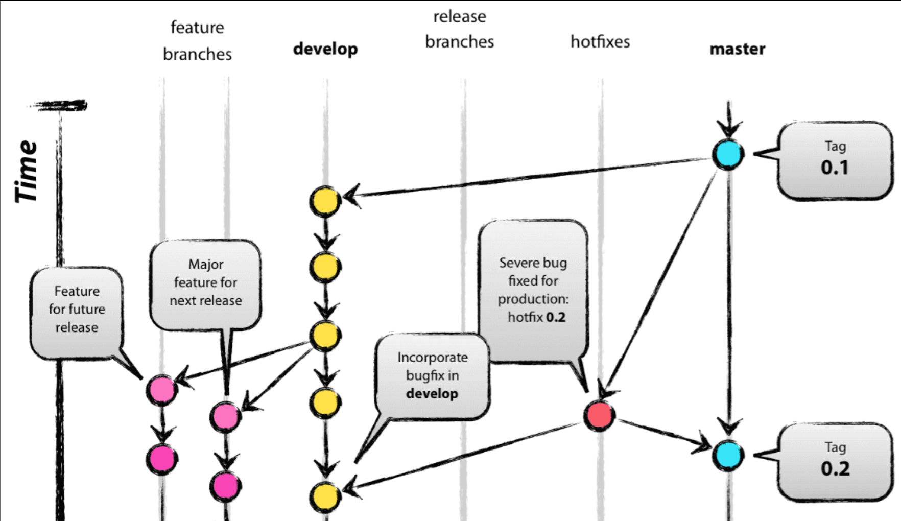

---

### Sumário

- **develop** é criado a partir do **master**
- **feature-x** é criado a partir do **develop**
- Após finalizado o branch **feature-x**, realiza-se o merge para o **develop**
- Após as features previstas para uma release estarem no develop, cria-se um branch **release** a partir do **develop**
- O branch **release** conta com tarefas para publicação, bug fixes e documentação.

---

- Quando um branch **release** é finalizado, realiza-se o merge desse branch no **develop** e no **master**, cria-se uma tag para facilitar futuras referências no histórico, e exclui o branch dessa release.
- Se um problema é identificado no **master** um branch **hotfix-x** é criado.
- Quando **hotfix-x** é finalizado, é feito o merge no **master** e no **develop**

---

## Exercício: git merge e conflitos

- Inicialize um repositório e um branch master com um arquivo README.md.
- Crie dois branches a partir do master, cada um com alterações distintas
- Realize o merge desses branches

---

```sh
  git init
  git checkout -b master
  # Adicionar README.md
  git add . && git commit -m "initial commit"
  git checkout -b novidade1a
  # modificar README.md
  git add . && git commit -m "added novidade1a"
  git checkout master
  git checkout -b novidade1b
  # modificar README.md
  git add . && git commit-m "added novidade1b"
  git merge novidade1a novidade1b
  git diff
  # resolver conflitos
  git add README.md && git commit -m "solved"
```

---

## Sincronizando repositórios

- **git clone**: baixa uma cópia local de um repositório remoto
- **git remote**: configurações de origem do repositório
- **git push**: envia modificações para origem
- **git pull**: baixa últimas modificações da origem

---

```sh
 git init
```


---

```sh
  git remote add origin https://...
  echo "Hello World" >> README.md
  git commit -a -m "initial commit"
  git push origin master
```

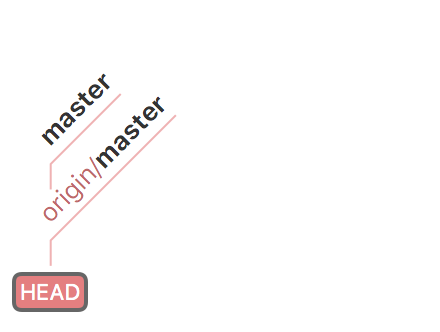

---

```sh
  git checkout -b develop
```

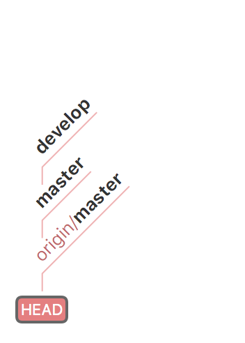

---

```sh
  echo "Hello World from Develop" >> README.md
  git add README.md
  git commit -m "add initial text"
```

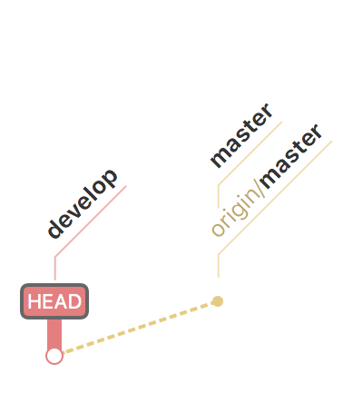

---

```sh
  git push origin develop
```

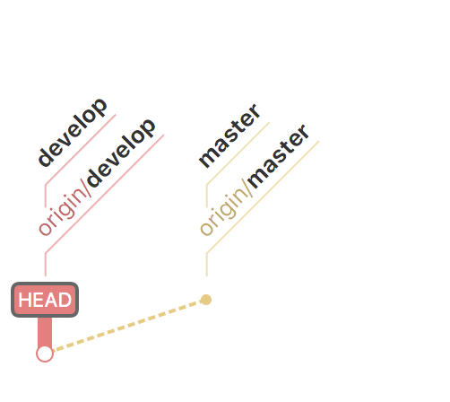

---

### Contexto atual

- Desenvolvimento de alterações foi inicialiazado
- Branch master não aceita commits diretos
- Próximo passo: abrir um _pull request_

---

### Pull request

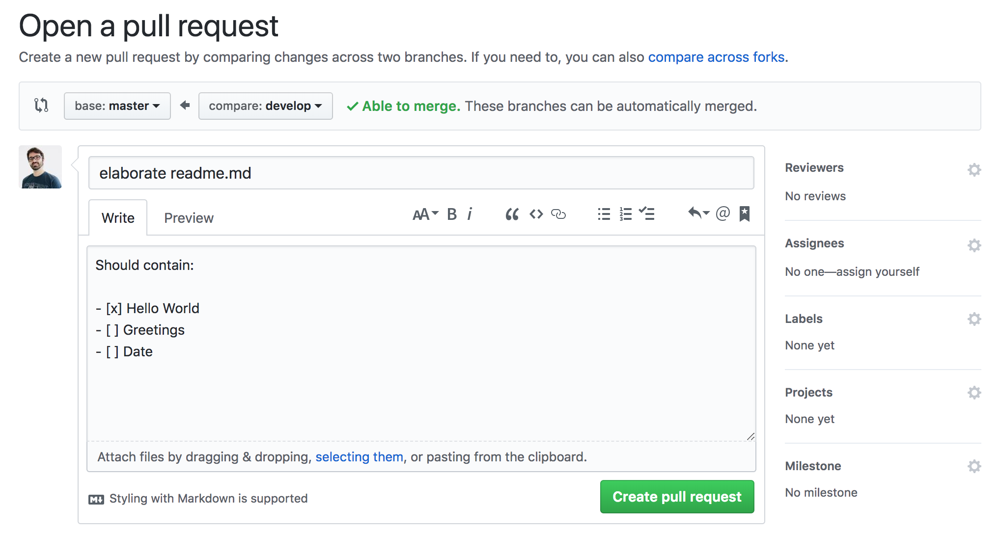

---

### Pull request - Sem Conflitos

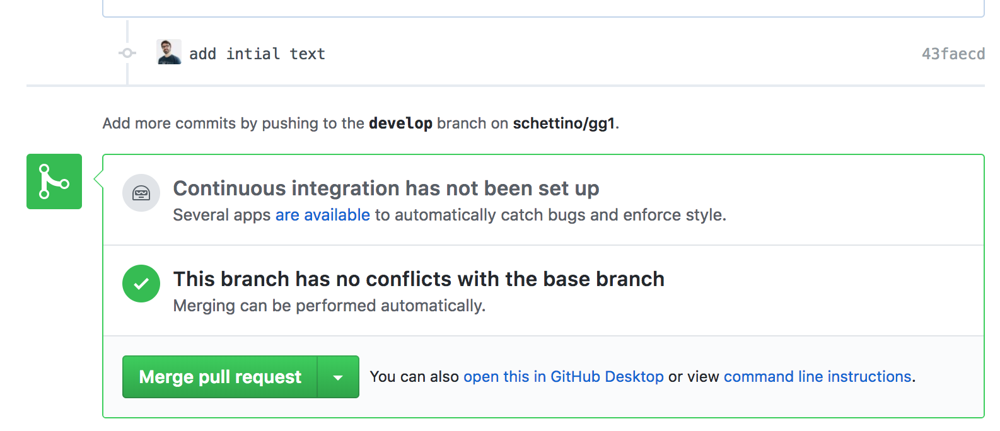

---

### Contexto atual

- O desenvolvimento do projeto continuou por outra parte da equipe
- Branch master possui novas alterações não sincronizadas com o branch em desenvolvimento
- Mesmos arquivos sofreram alterações

---

### Pull request - Com Conflitos

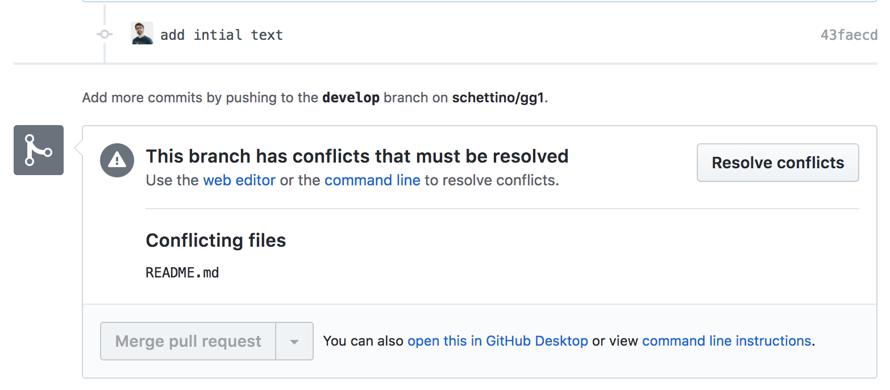

---

### Histórico atual

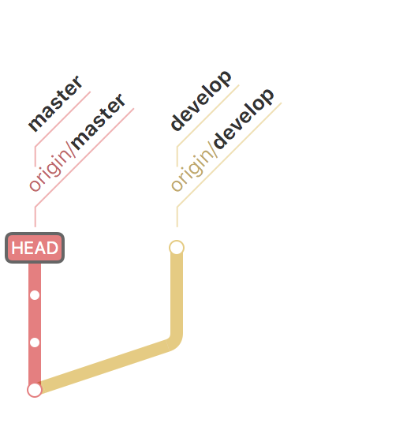

---

## Problema:

- como sincronizar as alterações do master no branch atual a fim de possibilitar o teste das funcionalidades já integradas com as em desenvolvimento?

---

### Tentativa 1: git pull origin master

---

```sh
  git pull origin master
  git status
  # (resolução de conflitos)
```

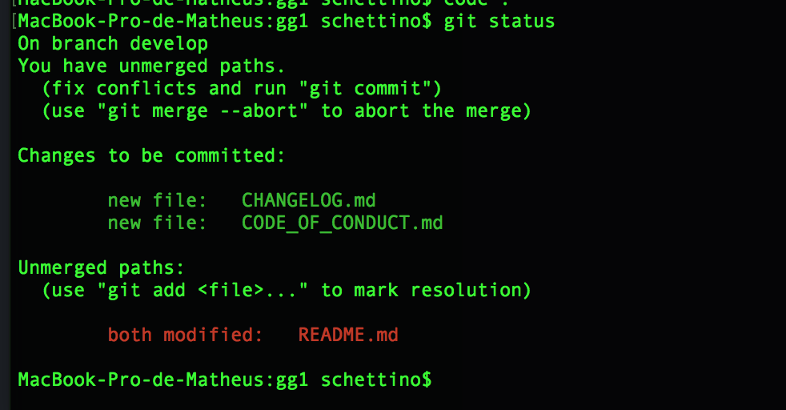

---

_Note que arquivos que não pertenciam ao develop passaram a fazer parte do pull request_

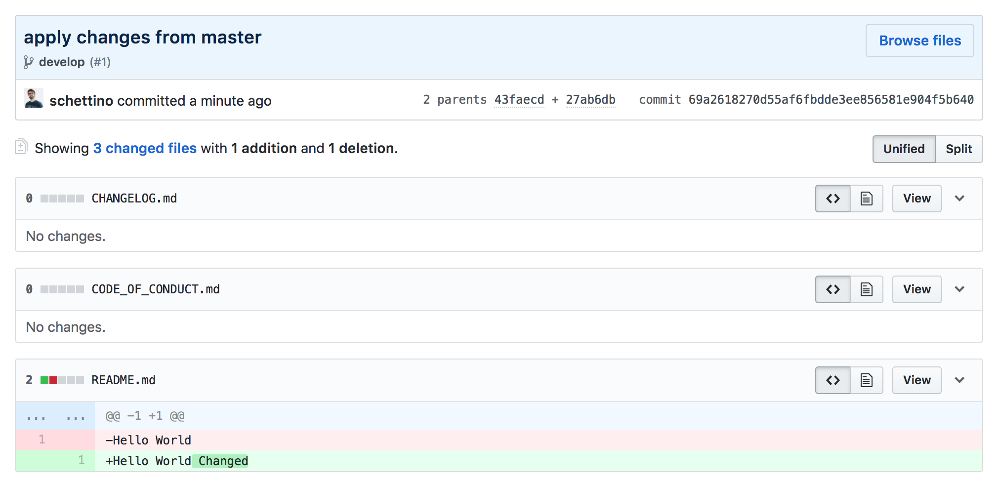

---

**No entanto, após o pull request ser consolidado, nota-se que o histórico de commits não foi preservado de forma adequada**

---

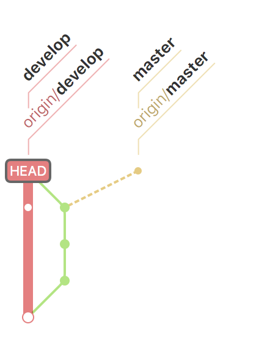

---

### Tentativa 2: git-rebase

---

_Contexto atual_

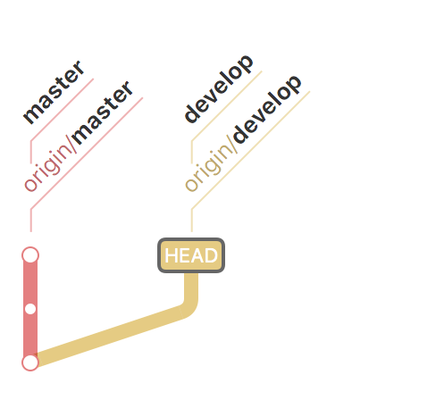

---

```sh
  git pull --rebase
```

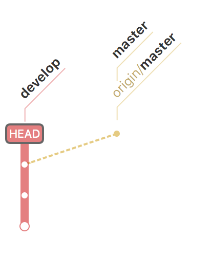

---

### git-rebase vs git-merge

rebase: aplica modificações do branch de origem à extremidade do branch de destino

merge: adiciona modificações do branch de origem ao branch de destino.

---

### git-rebase vs git-merge

rebase: alinhar o histórico do branch local com modificações de um branch remoto

merge: incrementar um branch com novas modificações

---

## Problema

- **git-merge não preserva histórico**

---

## Problema

- **git-rebase é uma operação destrutiva**

---

_Resumo_

- Vimos a razão do git ser a forma de versionar código mais popular
- Os estágios do commit e suas implicações
- A evolução de workflows para projetos de todos os tamanhos
- Como sincronizar um repositório local com um remoto
- Como realizar branching e resolver conflitos comuns

---

<!-- REFERÊNCIAS -->

### Referências

- [Pro Git 2nd Edition (2014), _Scott Chacon_](https://github.com/progit/progit2)
- [Atlassian tutorials](https://www.atlassian.com/git/tutorials)
- [Gitflow, _Vincent Driessen_](http://nvie.com/posts/a-successful-git-branching-model/)
- [git-merge vs git-rebase](https://www.derekgourlay.com/blog/git-when-to-merge-vs-when-to-rebase/)
