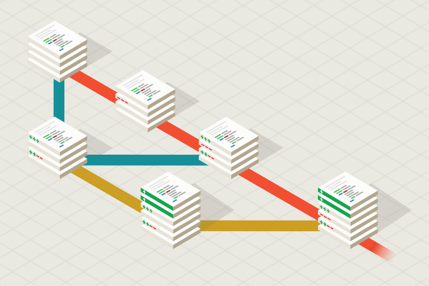
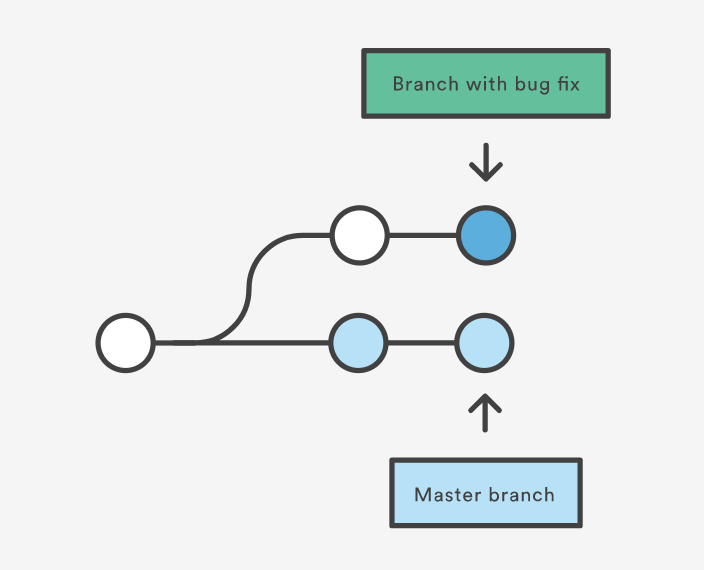

# Git

### Desenvolvimento de Software 3

---

---

## Tópicos - Parte 1

 - Introdução
 - Comandos
 - Workflows
 - Branching
 - Desafios comuns
 
---

## Tópicos - Parte 2

 - Code review
 - Github
 - CI & CD
 - Exemplo: do commit ao publish
 - Open source

--- 

## Introdução

 - Contexto histórico
 - Por que Git?
 - O que é um repositório

--- 

### esta apresentação será conduzida de forma a contextualizar os elementos de controle do git com workflows exigidos desde pequenos à grandes projetos.

---

 ## Comandos iniciais

--- 

 - git init
 - git remote
 - git log
 - git status

---

 # Workflows

---

 - Centralizado
 - Feature Branching
 - Gitflow

---

 ## Centralizado

---

 ## Feature Branch

--- 

# Branching

---

---

 ## Comandos

 - git branch
 - git checkout
 - git add
 - git commit
 - git push
 - git pull

---

## Desafios comuns

---

 - origin/branch recebeu atualizações
 - merges realizados no ancestral do branch atual

--- 

## Outros problemas

 - Commit com mensagem e/ou arquivos errados
 - Commit em branch errado
 - Merge realizado em branch errado
 - Hitórico de commits não preservado

--- 

## Soluções

 - git-reset e git-amend
 - git rebase
 - git pull --rebase
 - git merge --no-ff

--- 

 ### Desfazendo commit local

 __git-amend__

 Desfaz último commit, movendo alterações de volta para `staging` e cria um novo commit com as correções.

 Novas alterações que entraram em `staging` serão commitadas também.

---

 __git-amend__

_Problemas_: 
  - Commit anterior já havia sido enviado
  - Commit dado em branch errado

---

 __git-amend__  
 _Commit anterior já havia sido enviado_

 _amend_ afetará histórico do branch. Alguém da equipe pode ter iniciado um novo trabalho baseado no commit a ser removido.

 Envio modificações no histórico é impedido a menos que use `git push --force`

---

 __git-amend__  
 _Commit dado em branch errado_

 Solução: `git reset [--soft | --mixed | --hard] ..`

---

 # Gitflow

---

<!-- REFERÊNCIAS -->

### Referências

 - Pro Git 2nd Edition (2014), _Scott Chacon_
 - [Atlassian tutorials](https://www.atlassian.com/git/tutorials)
 - [Gitflow, _Vincent Driessen_](http://nvie.com/posts/a-successful-git-branching-model/)